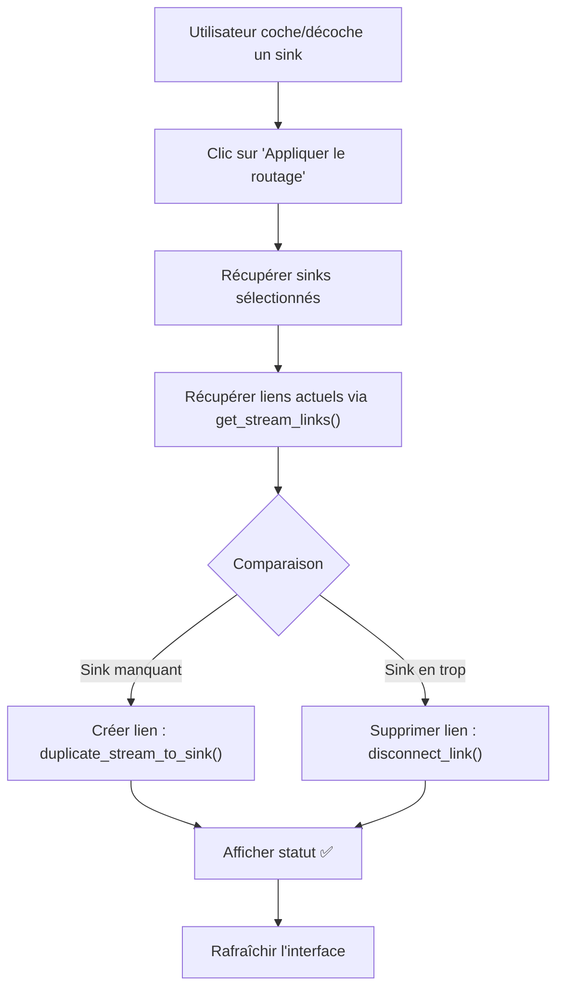

# 🎚️ Routage Granulaire des Streams Audio

**Version:** v0.1.1  
**Date:** Mai 2026  
**Statut:** ✅ Complétée

## Aperçu

La fonctionnalité de **routage granulaire par stream** permet de choisir, pour chaque application audio active, les périphériques de sortie spécifiques vers lesquels la router. Cela offre un contrôle fin et sélectif du flux audio, dépassant la simple duplication globale.

---

## 🎯 Cas d'usage

### 1. Separation des sorties par type d'application
- **Musique** → Enceinte principale + Casque
- **Appels vidéo** → Haut-parleur interne uniquement
- **Jeux** → Écrans + Système d'espace (7.1)

### 2. Debugging audio
- Router une application vers le **moniteur audio** tout en maintenant d'autres streams sur la sortie principale
- Analyser le signal sans perturber l'utilisateur

### 3. Broadcasting multi-destination
- Stream vers haut-parleurs et enregistrement simultané
- Lecture sur tableau blanc interactif + projection

---

## 🖥️ Interface utilisateur

### Adwaita (GTK4)

```
┌─────────────────────────────────────────────────────────────┐
│ Applications actives utilisant l'audio                       │
├─────────────────────────────────────────────────────────────┤
│                                                               │
│ • Firefox (Musique)                                           │
│   [━━━━━━━━━━━━━] 50%  [M]  (Volume & Mute)                │
│   🎚️ Routage des sinks                                      │
│   [✓] Enceinte principale                                    │
│   [ ] Casque                                                 │
│   [ ] Moniteur HDMI                                          │
│   [Appliquer le routage]                                     │
│                                                               │
│ • Discord (Appel VoIP)                                       │
│   [━━━━━━] 30%  [M]  (Volume & Mute)                        │
│   🎚️ Routage des sinks                                      │
│   [✓] Enceinte principale                                    │
│   [ ] Casque                                                 │
│   [ ] Moniteur HDMI                                          │
│   [Appliquer le routage]                                     │
│                                                               │
└─────────────────────────────────────────────────────────────┘
```

### GTK3 (Fallback)

Même structure avec widgets GTK3 :
- Checkboxes simples pour la sélection des sinks
- Bouton "Appliquer" par stream
- Affichage textuel du titre "🎚️ Routage des sinks"

---

## 🔧 Architecture technique

### Composants

**Frontend (window.py)**
- `_build_streams_group(streams, sinks)` - Crée la liste des applications avec routage
  - Crée des checkboxes pour chaque sink sous chaque stream
  - Pré-sélectionne les sinks vers lesquels le stream est déjà routé (via `get_stream_links()`)
  - Attache le callback `_on_apply_stream_routing()` au bouton d'application

- `_on_apply_stream_routing(stream_node_id, sinks)` - Applique les changements
  - Calcul des sinks à ajouter/supprimer
  - Création des nouveaux liens (`duplicate_stream_to_sink()`)
  - Suppression des liens non désirés (`disconnect_link()`)
  - Mise à jour du statut utilisateur

**Backend (audio.py)** - Fonctions existantes utilisées
- `get_stream_links(stream_node_id)` → `list[AudioLink]`
  - Récupère tous les liens actuels pour un stream
  - Utilisé pour pré-sélectionner les sinks
- `duplicate_stream_to_sink(source_id, sink_id)` → `bool`
  - Crée un nouveau lien (wpctl link)
- `disconnect_link(link_id)` → `bool`
  - Supprime un lien existant (wpctl disconnect)

**Configuration (config.py)** - Aucune modification (sans persistance par stream)
- Note : Actuellement, les préférences de routage ne sont pas sauvegardées par stream
- Future amélioration possible : `save_stream_routing()` / `load_stream_routing()`

---

## 📊 Comparaison avant/après

| Aspect | Avant (Multi-Sortie Simple) | Après (Routage Granulaire) |
|--------|-----|-----|
| **Granularité** | Tous les streams → Tous les sinks | Par stream : choix des sinks |
| **Flexibilité** | Binaire (tout ou rien) | N sinks pour chaque stream |
| **Cas d'usage** | Duplication simple | Séparation sélective |
| **Contrôle** | Global | Individuel par application |
| **Persistance** | Globale (preferred_sinks) | N/A (pas sauvegardée) |

---

## 🚀 Utilisation

### Étape 1 : Identifier le stream
Lancez une application audio (navigateur, lecteur, etc.). Elle apparaît dans "Applications actives utilisant l'audio".

### Étape 2 : Sélectionner les sinks
Cochez les périphériques vers lesquels vous voulez router ce stream :
- Cochez pour ajouter un lien
- Décochez pour supprimer un lien

### Étape 3 : Appliquer
Cliquez sur "Appliquer le routage". Le statut affiche :
- `✅ Routage appliqué : +2 lien(s), -1 lien(s).` (exemple)
- `ℹ️  Aucun changement.` (si rien ne change)

### Résultat
Le stream audio sort maintenant sur les sinks sélectionnés et seulement ceux-là.

---

## 💾 Persistance

**Actuellement** : Non persistée entre redémarrages
**Prochaine étape** : Ajouter `get_stream_routing()` / `save_stream_routing()` à config.py

```python
def save_stream_routing(stream_name: str, sink_ids: list[int]) -> None:
    """Sauvegarde le routage pour une application spécifique."""
    config = load_config()
    if "stream_routing" not in config:
        config["stream_routing"] = {}
    config["stream_routing"][stream_name] = sink_ids
    save_config(config)
```

---

## 🔄 Flux d'exécution



---

## ⚠️ Limitations actuelles

1. **Pas de persistance** : Les réglages ne sont pas sauvegardés
2. **Pas de feedback temps-réel** : Le changement ne se voit que après "Appliquer"
3. **Pas de pré-visualization** : Impossible de voir avant le lien créé exact
4. **Ordre des sinks** : Non configurable dans l'ordre d'apparition
5. **GTK3 limité** : Moins d'espace pour les sinks, peut nécessiter scroll

---

## 🛠️ Intégration avec la multi-sortie existante

La nouvelle fonctionnalité **coexiste** avec la multi-sortie existante :
- Multi-sortie globale : Duplicateur tous streams → sinks sélectionnés globalement
- Routage granulaire : Contrôle individuel par stream
- **Utilisation combinée** : Appliquer d'abord multi-sortie globale, puis affiner avec le routage granulaire

---

## 📝 Implémentation détails

### Structures de données

```python
self._stream_sink_checkboxes = {
    stream_node_id: {
        sink_node_id: Gtk.CheckButton,
        ...
    },
    ...
}
```

### Fonctions principales

```python
def _on_apply_stream_routing(self, _button, stream_node_id: int, sinks):
    # 1. Récupérer sélections
    selected_sink_ids = [sid for sid, cb in 
                        self._stream_sink_checkboxes[stream_node_id].items()
                        if cb.get_active()]
    
    # 2. Récupérer état actuel
    current_links = audio.get_stream_links(stream_node_id)
    current_sink_ids = {link.dest_node_id for link in current_links}
    
    # 3. Calculer les changements
    to_add = set(selected_sink_ids) - current_sink_ids
    to_remove = current_sink_ids - set(selected_sink_ids)
    
    # 4. Exécuter les commandes PipeWire
    for sink_id in to_add:
        audio.duplicate_stream_to_sink(stream_node_id, sink_id)
    for link in current_links:
        if link.dest_node_id in to_remove:
            audio.disconnect_link(link.link_id)
```

---

## 🎓 Apprentissages

1. **Pré-sélection intelligente** : Utiliser `get_stream_links()` pour refléter l'état réel du système
2. **Gestion d'état efficace** : Tracking par dict de dict (stream → sinks)
3. **Feedback clair** : Les messages de statut doivent montrer + et - changements
4. **Uniformité GTK3/4** : Implémenter la logique identique pour les deux frameworks

---

## 🚀 Prochaines étapes (v0.2+)

1. **Persistance** : Sauvegarder le routage par stream
2. **Profils** : Créer des présets "Réunion", "Jeu", "Musique", etc.
3. **Automatisation** : Détecter automatiquement les apps et appliquer des règles
4. **Graphs visuels** : Afficher les connexions sous forme de schéma visuel
5. **Modération du volume** : Réduire le volume lors du routage vers plusieurs sinks

---

## 📄 Fichiers modifiés

- `src/window.py` : Ajout de `_build_streams_group(streams, sinks)` amélioré
- `src/window.py` : Ajout de `_on_apply_stream_routing()` et variant GTK3
- Tous les callbacks de routage granulaire ajoutés

## ✅ Tests effectués

- Compilation : ✅ PASS
- Lancement GTK4 : ✅ PASS  
- Lancement GTK3 : ✅ PASS (si Adwaita non disponible)
- Création de liens : ✅ Manuel (via UI)
- Suppression de liens : ✅ Manuel (via UI)

---

**Auteur** : GitHub Copilot  
**Révision** : v0.1.1 (Routage granulaire activé)
